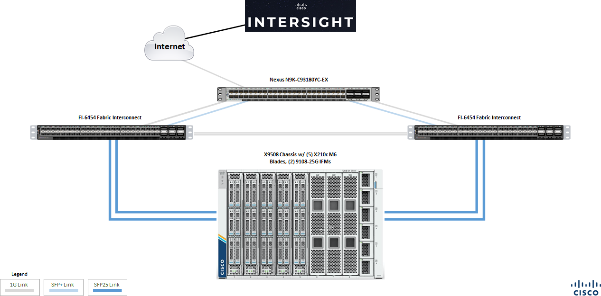

<h1 align="center">Cisco IMM Automation Tools</h1>

 

  

  
 

  Cisco IMM Automation Tools automates the build and deployment of Cisco UCS devices, policies, pools and profiles on Cisco Intersight Infrastructure Services for UCS X-Series hardware and previous generation UCS systems such as B-Series and C-Series. The automation of UCS under Intersight Managed Mode is simplified and requires minimal programming knowledge, enabling users to setup and run quickly.

 

## Build and Deployment Tools
- [UCS Default Policy Deployment Tool](./src/deployment_tools/ucs_default_policy_deployment_tool) - Quickly deploy your own set of 25 default UCS policies.
- [UCS Domain Deployment Tool](./src/deployment_tools/ucs_domain_deployment_tool) - Build, assign and deploy a UCS domain profile with all policies in minutes.
- [UCS FI Claim Handler](./src/deployment_tools/ucs_fi_claim_handler) - Claim one or more UCS IMM fabric interconnect clusters to an Intersight account.
- [UCS Server Deployment Tool](./src/deployment_tools/ucs_server_deployment_tool) - Coming soon!!!

## Policy Makers

###### For UCS Chassis
- [IMC Access Policy Maker](./src/policy_makers/imc_access_policy_maker) - Make a UCS IMC access policy.
- [Power Policy Maker](./src/policy_makers/power_policy_maker) - Make a UCS power policy.
- [SNMP Policy Maker](./src/policy_makers/snmp_policy_maker) - Make a UCS SNMP policy.
- [Thermal Policy Maker](./src/policy_makers/thermal_policy_maker) - Make a UCS thermal policy.

###### For UCS Domains
- [Ethernet Network Control Policy Maker](./src/policy_makers/ethernet_network_control_policy_maker) - Make a UCS ethernet network control policy.
- [Ethernet Network Group Policy Maker](./src/policy_makers/ethernet_network_group_policy_maker) - Make a UCS ethernet network group policy.
- [Flow Control Policy Maker](./src/policy_makers/flow_control_policy_maker) - Make a UCS flow control policy.
- [Link Aggregation Policy Maker](./src/policy_makers/link_aggregation_policy_maker) - Make a UCS link aggregation policy.
- [Link Control Policy Maker](./src/policy_makers/link_control_policy_maker) - Make a UCS link control policy.
- [Multicast Policy Maker](./src/policy_makers/multicast_policy_maker) - Make a UCS multicast policy.
- [Network Connectivity Policy Maker](./src/policy_makers/network_connectivity_policy_maker) - Make a UCS network connectivity (DNS) policy.
- [NTP Policy Maker](./src/policy_makers/ntp_policy_maker) - Make a UCS NTP policy.
- [Port Policy Maker](./src/policy_makers/port_policy_maker) - Make a UCS port policy.
- [SNMP Policy Maker](./src/policy_makers/snmp_policy_maker) - Make a UCS SNMP policy.
- [Switch Control Policy Maker](./src/policy_makers/switch_control_policy_maker) - Make a UCS switch control policy.
- [Syslog Policy Maker](./src/policy_makers/syslog_policy_maker) - Make a UCS syslog policy.
- [System QoS Policy Maker](./src/policy_makers/system_qos_policy_maker) - Make a UCS system QoS policy.
- [VLAN Policy Maker](./src/policy_makers/vlan_policy_maker) - Make a UCS VLAN policy.
- [VSAN Policy Maker](./src/policy_makers/vsan_policy_maker) - Make a UCS VSAN policy.

###### For UCS Servers
- [BIOS Policy Maker](./src/policy_makers/bios_policy_maker) - Make a UCS BIOS policy.
- [Boot Order Policy Maker](./src/policy_makers/boot_order_policy_maker) - Make a UCS boot order policy.
- [Certificate Management Policy Maker](./src/policy_makers/cert_mgmt_policy_maker) - Make a UCS certificate management policy.
- [Ethernet Adapter Policy Maker](./src/policy_makers/ethernet_adapter_policy_maker) - Make a UCS ethernet adapter policy.
- [Ethernet Network Control Policy Maker](./src/policy_makers/ethernet_network_control_policy_maker) - Make a UCS ethernet network control policy.
- [Ethernet Network Group Policy Maker](./src/policy_makers/ethernet_network_group_policy_maker) - Make a UCS ethernet network group policy.
- [Ethernet QoS Policy Maker](./src/policy_makers/ethernet_qos_policy_maker) - Make a UCS ethernet QoS policy.
- [FC Zone Policy Maker](./src/policy_makers/fc_zone_policy_maker) - Make a UCS FC zone policy.
- [Fibre Channel Adapter Policy Maker](./src/policy_makers/fibre_channel_adapter_policy_maker) - Make a UCS fibre channel adapter policy.
- [Fibre Channel Network Policy Maker](./src/policy_makers/fibre_channel_network_policy_maker) - Make a UCS fibre channel network policy.
- [Fibre Channel QoS Policy Maker](./src/policy_makers/fibre_channel_qos_policy_maker) - Make a UCS fibre channel QoS policy.
- [IMC Access Policy Maker](./src/policy_makers/imc_access_policy_maker) - Make a UCS IMC access policy.
- [IPMI Over LAN Policy Maker](./src/policy_makers/ipmi_over_lan_policy_maker) - Make a UCS IPMI over LAN policy.
- [iSCSI Adapter Policy Maker](./src/policy_makers/iscsi_adapter_policy_maker) - Make a UCS iSCSI adapter policy.
- [iSCSI Boot Policy Maker](./src/policy_makers/iscsi_boot_policy_maker) - Make a UCS iSCSI boot policy.
- [iSCSI Static Target Policy Maker](./src/policy_makers/iscsi_static_target_policy_maker) - Make a UCS iSCSI static target policy.
- [LAN Connectivity Policy Maker](./src/policy_makers/lan_connectivity_policy_maker) - Make a UCS LAN connectivity policy.
- [Local User Policy Maker](./src/policy_makers/local_user_policy_maker) - Make a UCS local user policy.
- [SAN Connectivity Policy Maker](./src/policy_makers/san_connectivity_policy_maker) - Make a UCS SAN connectivity policy.
- [SD Card Policy Maker](./src/policy_makers/sd_card_policy_maker) - Make a UCS SD card policy.
- [Serial Over LAN Policy Maker](./src/policy_makers/serial_over_lan_policy_maker) - Make a UCS serial over LAN policy.
- [SNMP Policy Maker](./src/policy_makers/snmp_policy_maker) - Make a UCS SNMP policy.
- [Syslog Policy Maker](./src/policy_makers/syslog_policy_maker) - Make a UCS syslog policy.
- [Virtual KVM Policy Maker](./src/policy_makers/virtual_kvm_policy_maker) - Make a UCS virtual KVM policy.
- [Virtual Media Policy Maker](./src/policy_makers/virtual_media_policy_maker) - Make a UCS virtual media policy.

## Pool Makers
- [IP Pool Maker](./src/pool_makers/ip_pool_maker) - Make a UCS IP pool.
- [IQN Pool Maker](./src/pool_makers/iqn_pool_maker) - Make a UCS IQN pool.
- [MAC Pool Maker](./src/pool_makers/mac_pool_maker) - Make a UCS MAC pool.
- [Resource Pool Maker](./src/pool_makers/resource_pool_maker) - Make a UCS resource pool.
- [UUID Pool Maker](./src/pool_makers/uuid_pool_maker) - Make a UCS UUID pool.
- [WWNN Pool Maker](./src/pool_makers/wwnn_pool_maker) - Make a UCS WWNN pool.
- [WWPN Pool Maker](./src/pool_makers/wwpn_pool_maker) - Make a UCS WWPN pool.

## Base Profile Makers
- [Base UCS Domain Profile Maker](./src/profile_makers/ucs_domain_profile_maker) - Make and assign a base UCS domain profile without the policies.

## Demonstrations and Learning Labs
Cisco IMM Automation Tools can be demoed on Cisco dCloud in the following content:

1. [Cisco Intersight with UCS X-Series Demo](https://dcloud2-rtp.cisco.com/content/instantdemo/cisco-intersight-mode-with-ucs-x-series-v1-instant-demo-2)
2. [Cisco Intersight with UCS X-Series Lab](https://dcloud2.cisco.com/demo/cisco-intersight-management-with-x-series-lab-v1)
3. Cisco Intersight with UCS B-Series Lab - Coming soon!

dCloud is available at [https://dcloud.cisco.com](https://dcloud.cisco.com), where Cisco product demonstrations and labs can be found in the Catalog.

## Author
Ugo Emekauwa

## Contact Information
uemekauw@cisco.com or uemekauwa@gmail.com
