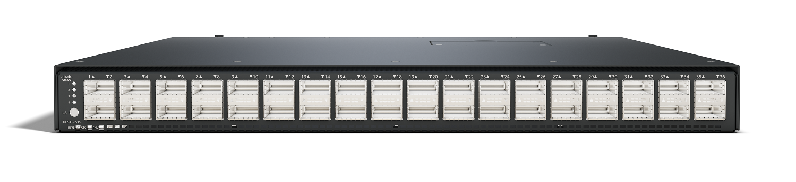

# Cisco IMM Automation Tools - Use Cases

 

  

  
 

- Claim one or more UCS IMM fabric interconnect clusters to an Intersight account.
- Quickly deploy your own set of 27 default UCS policies.
- Build, assign and deploy a UCS domain profile with all policies in minutes.
- Build, assign and deploy many UCS server profiles, along with a template and all policies and pools in minutes.
- Build, assign and deploy many UCS chassis profiles with all policies and pools in seconds.
